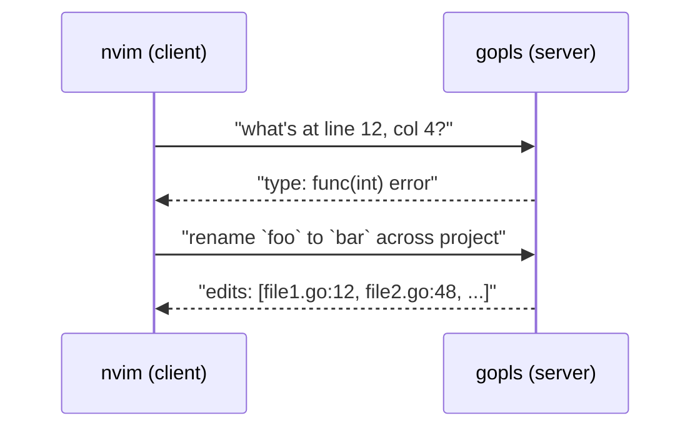
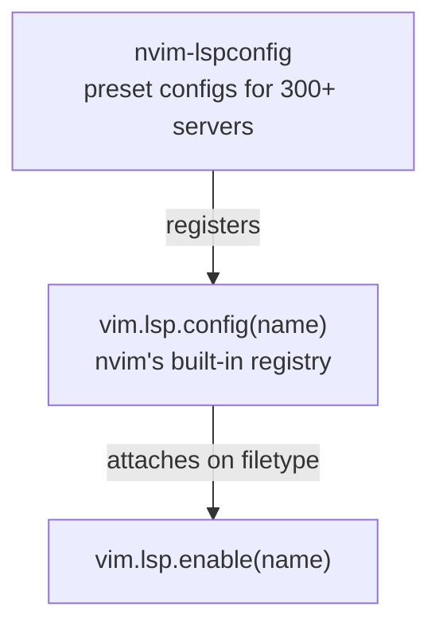
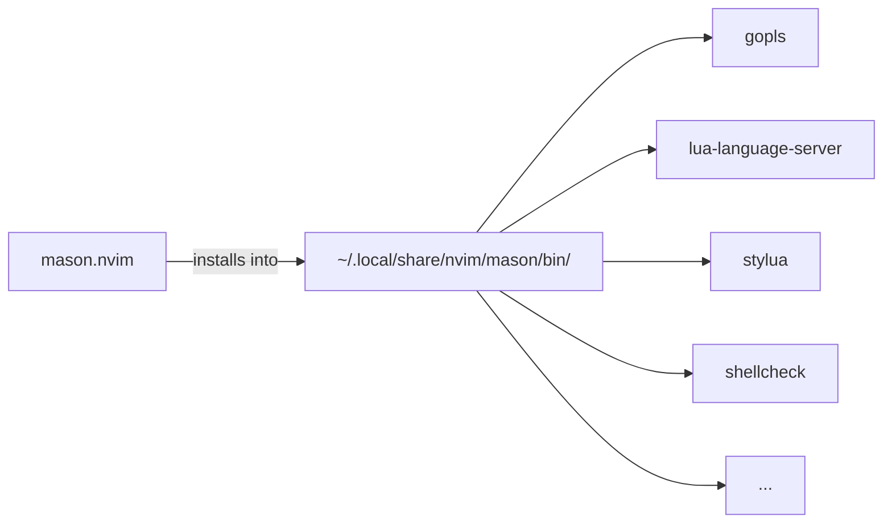
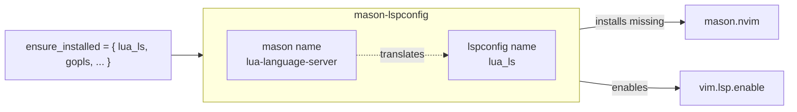
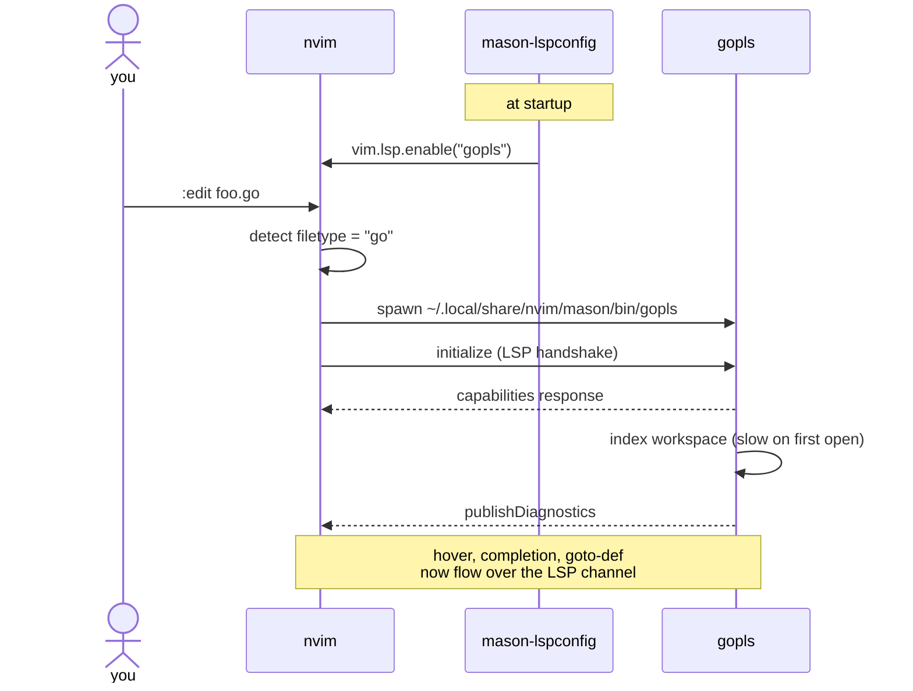
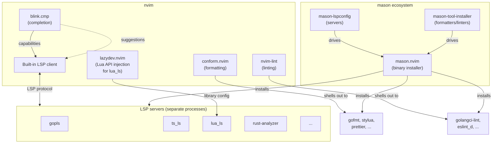

# How LSP works in this config

LSP feels complicated because what looks like one feature is actually several plugins cooperating. This file untangles them.

---

## 1. What is LSP, really?

LSP is just a **protocol** — a JSON message format spoken between two processes:



The **server** is a separate executable per language (`gopls`, `lua-language-server`, `rust-analyzer`, etc.).
It parses your code, keeps an in-memory index, and answers questions about it.

The **client** is nvim itself.
nvim has LSP support built in — it knows how to speak the protocol natively (since v0.5+).

---

## 2. The piece nvim doesn't give you

nvim's built-in LSP client needs to know:

- **Where the server binary lives** on disk
- **What command to launch it with**
- **Which filetypes** to attach it to
- **What workspace settings** it expects

You could write all this yourself (it's a few lines per server).
Most people don't, because someone already did, in **nvim-lspconfig**.



nvim-lspconfig is a giant lookup table.
It registers configs with nvim under names like `gopls`, `lua_ls`, `ts_ls`.
You then call `vim.lsp.enable("gopls")` and nvim attaches it on the right filetypes.

---

## 3. But how do the *server binaries* get installed?

Each LSP server is a separate program.
`gopls` is a Go binary; `lua-language-server` is a Lua/C++ project; `rust-analyzer` is a massive Rust binary.
You'd normally install each via `brew install`, `go install`, `cargo install`, `npm i -g`, etc.

That's tedious and inconsistent.
**mason.nvim** solves it: it's a package manager that installs LSP servers (plus formatters and linters) into a single directory nvim already knows about (`~/.local/share/nvim/mason/`).



This directory is on nvim's PATH, so `vim.lsp.enable("gopls")` just finds the binary.

---

## 4. The bridge: mason-lspconfig

mason knows binaries.
nvim-lspconfig knows configs.
They use different naming (`lua-language-server` vs `lua_ls`).

**mason-lspconfig.nvim** bridges them:



In our config:

```lua
require("mason-lspconfig").setup({
  ensure_installed = { "gopls", "lua_ls", ... },
  automatic_enable = true,
})
```

This does two things:

1. **Installs** any listed server that's missing (via mason)
2. **Enables** them with nvim (via `vim.lsp.enable()`)

So one line per server in `ensure_installed` is all you need.

---

## 5. Putting it together: what happens when you open `foo.go`



You can confirm the server is attached with `:LspInfo`.

---

## 6. LSP ≠ formatting ≠ linting

LSP gives you **interactive intelligence**: hover, diagnostics, goto-def, rename, completion.

But many things people lump under "LSP" actually aren't:

| What you want    | LSP? | Plugin               | How it works            |
| ---------------- | ---- | -------------------- | ----------------------- |
| Hover, diagnostics, goto-def, rename | yes  | nvim-lspconfig + LSP server | LSP protocol |
| Completion menu  | yes (uses LSP) | blink.cmp     | LSP + extra sources |
| Format on save   | no   | conform.nvim         | Runs CLI: `gofmt`, `prettier`, ... |
| Inline lint warnings (extra rules) | no   | nvim-lint | Runs CLI: `golangci-lint`, `eslint_d`, ... |
| `vim.*` autocomplete in Lua | no | lazydev.nvim | Library injection for lua_ls |

Formatters and linters are **separate CLI tools** that nvim shells out to.
They have nothing to do with LSP. mason installs them too, which is why it all *feels* like one system.

---

## 7. The full picture in this config



Each plugin has one job:

- **nvim-lspconfig** — preset configs for LSP servers
- **mason.nvim** — installs server/formatter/linter binaries
- **mason-lspconfig** — bridges mason naming ↔ lspconfig naming, and auto-enables installed servers
- **mason-tool-installer** — same as ensure_installed, but for non-LSP tools (formatters, linters)
- **blink.cmp** — completion menu; pulls suggestions from LSP and other sources
- **conform.nvim** — orchestrates formatters on save
- **nvim-lint** — runs linters on save / on InsertLeave
- **lazydev.nvim** — tells `lua_ls` where to find nvim's Lua API and plugin sources so editing this config gives proper completions

---

## 8. Useful commands

| Command          | What it shows                                    |
| ---------------- | ------------------------------------------------ |
| `:LspInfo`       | Which LSP servers are attached to current buffer |
| `:Mason`         | UI to view/install/uninstall mason packages      |
| `:ConformInfo`   | Which formatter conform will run for this file   |
| `:checkhealth`   | Nvim health report (LSP, treesitter, etc.)       |
| `K`              | Hover docs for symbol under cursor               |
| `gd`             | Goto definition                                  |
| `grr`            | List references                                  |
| `grn`            | Rename symbol (project-wide via LSP)             |
| `gra`            | Code actions                                     |
| `]d` / `[d`      | Next/prev diagnostic                             |
| `<C-s>` (insert) | Signature help                                   |
| `<C-y>` (insert) | Accept completion                                |
| `<C-space>` (insert) | Open completion / docs                       |

---

## 9. Troubleshooting

**A server isn't attaching:**

1. `:LspInfo` — is the server listed? If not, mason-lspconfig didn't enable it.
2. `:Mason` — is the binary installed?
3. `:checkhealth vim.lsp` — config errors here.

**Diagnostics seem wrong / outdated:** restart the server with `:LspRestart`.

**Completion isn't appearing:** check `:ConformInfo` isn't blocking (format-on-save eating keystrokes), and that blink.cmp's Rust build succeeded — `:checkhealth blink.cmp`.

**Lua `vim.*` shows as undefined:** lazydev should fix this.
If it doesn't, `:LazyDev` to inspect what library paths it injected.
