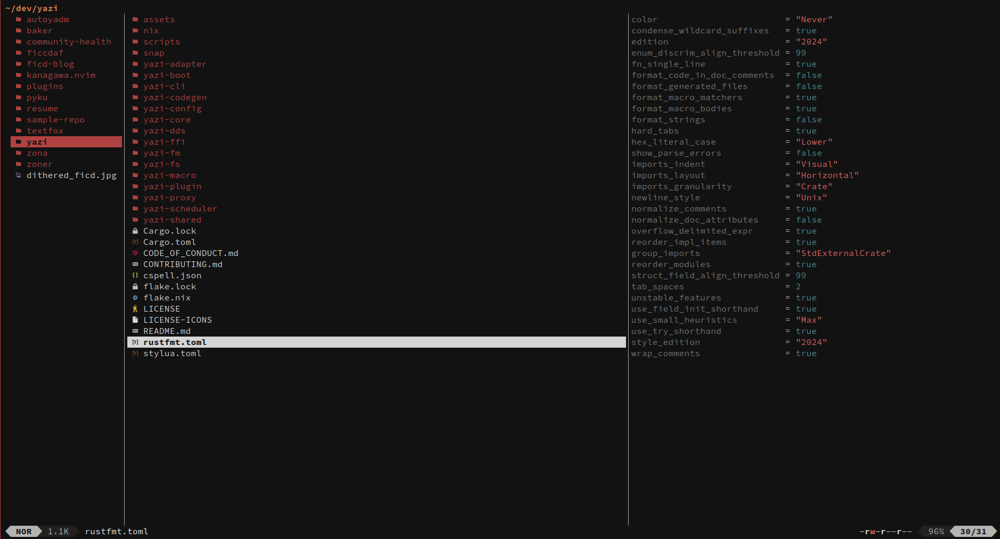

## 👀 Preview



## 🎨 Installation

You can install Ashen with Yazi's package manager:

```bash
ya pack -a ficcdaf/ashen:ashen
```

Alternatively, download the `ashen.yazi` folder and place it inside
`~/.config/yazi/flavors/`.

## ⚙️ Usage

To set it as your dark flavor, change the content of your `theme.toml` to:

```toml
[flavor]
dark = "ashen"
```

Make sure your `theme.toml` doesn't contain anything other than `[flavor]`,
unless you want to override certain styles of this flavor.

See the
[Yazi flavor documentation](https://yazi-rs.github.io/docs/flavors/overview) for
more details.

## 📜 License

The flavor is MIT-licensed, and the included tmTheme is also MIT-licensed.

Check the [LICENSE](LICENSE) and [LICENSE-tmtheme](LICENSE-tmtheme) file for
more details.
